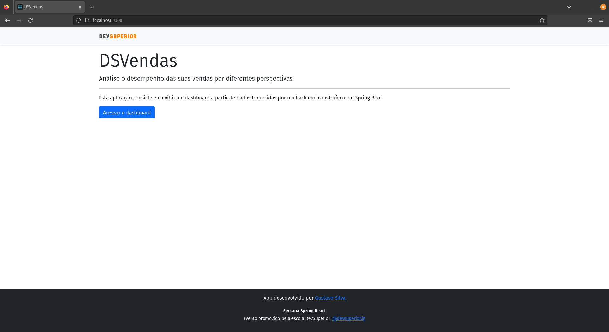
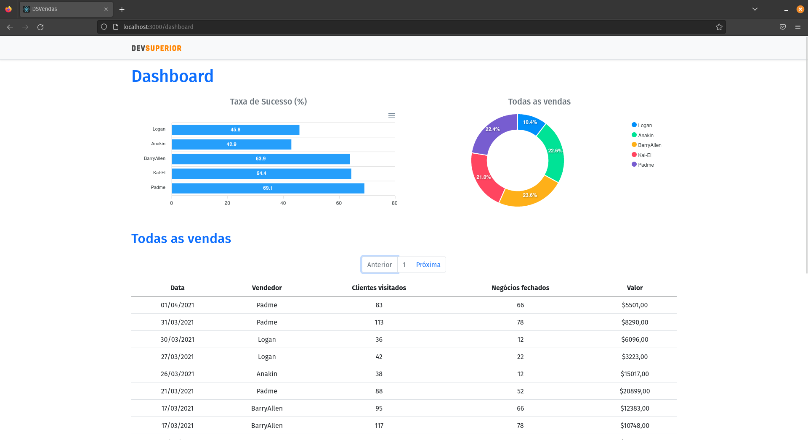

# projeto SDS4 <!-- omit from toc -->

Projeto da Semana Spring React, porém com o backend refeito em Kotlin, em vez do Java.

A aplicação consiste em:
- Um frontend escrito com ReactJs e Typescript;
- Um backend escrito com Spring Boot e Kotlin, além de testes unitários.


## Tabela de conteúdos <!-- omit from toc -->

- [Telas da Aplicação](#telas-da-aplicação)
- [Contrato da API](#contrato-da-api)
- [Endpoints da aplicação](#endpoints-da-aplicação)
  - [/sales](#sales)
    - [GET](#get)
      - [Summary:](#summary)
      - [Parameters](#parameters)
      - [Responses](#responses)
  - [/sales/amount-by-seller](#salesamount-by-seller)
    - [GET](#get-1)
      - [Summary:](#summary-1)
      - [Responses](#responses-1)
  - [/sales/success-by-seller](#salessuccess-by-seller)
    - [GET](#get-2)
      - [Summary:](#summary-2)
      - [Responses](#responses-2)
  - [/sellers](#sellers)
    - [GET](#get-3)
      - [Summary:](#summary-3)
      - [Responses](#responses-3)
  - [Models](#models)
    - [ModelAndView](#modelandview)
    - [Pageable](#pageable)
    - [Page«SaleDTO»](#pagesaledto)
    - [SaleDTO](#saledto)
    - [SaleSuccessDTO](#salesuccessdto)
    - [SaleSumDTO](#salesumdto)
    - [SellerDTO](#sellerdto)
    - [Sort](#sort)
    - [View](#view)
- [Como rodar a aplicação](#como-rodar-a-aplicação)
- [Tecnologias utilizadas](#tecnologias-utilizadas)
- [Dependencias](#dependencias)
- [Licença](#licença)
- [Autor](#autor)

## Telas da Aplicação

**Home**



**Dashboard**



## Contrato da API

<details>
  <summary>Arquivo para montar a API no Swagger</summary>

```json
{
    "swagger": "2.0",
    "info": {
        "description": "Api da semana spring react refeita em kotlin",
        "version": "1.0.0",
        "title": "DSVendas backend"
    },
    "host": "localhost:8080",
    "basePath": "/",
    "tags": [
        {
            "name": "basic-error-controller",
            "description": "Basic Error Controller"
        },
        {
            "name": "sale-controller",
            "description": "Sale Controller"
        },
        {
            "name": "seller-controller",
            "description": "Seller Controller"
        }
    ],
    "paths": {
        "/error": {
            "get": {
                "tags": [
                    "basic-error-controller"
                ],
                "summary": "errorHtml",
                "operationId": "errorHtmlUsingGET",
                "produces": [
                    "text/html"
                ],
                "responses": {
                    "200": {
                        "description": "OK",
                        "schema": {
                            "$ref": "#/definitions/ModelAndView"
                        }
                    },
                    "401": {
                        "description": "Unauthorized"
                    },
                    "403": {
                        "description": "Forbidden"
                    },
                    "404": {
                        "description": "Not Found"
                    }
                },
                "deprecated": false
            },
            "head": {
                "tags": [
                    "basic-error-controller"
                ],
                "summary": "errorHtml",
                "operationId": "errorHtmlUsingHEAD",
                "consumes": [
                    "application/json"
                ],
                "produces": [
                    "text/html"
                ],
                "responses": {
                    "200": {
                        "description": "OK",
                        "schema": {
                            "$ref": "#/definitions/ModelAndView"
                        }
                    },
                    "204": {
                        "description": "No Content"
                    },
                    "401": {
                        "description": "Unauthorized"
                    },
                    "403": {
                        "description": "Forbidden"
                    }
                },
                "deprecated": false
            },
            "post": {
                "tags": [
                    "basic-error-controller"
                ],
                "summary": "errorHtml",
                "operationId": "errorHtmlUsingPOST",
                "consumes": [
                    "application/json"
                ],
                "produces": [
                    "text/html"
                ],
                "responses": {
                    "200": {
                        "description": "OK",
                        "schema": {
                            "$ref": "#/definitions/ModelAndView"
                        }
                    },
                    "201": {
                        "description": "Created"
                    },
                    "401": {
                        "description": "Unauthorized"
                    },
                    "403": {
                        "description": "Forbidden"
                    },
                    "404": {
                        "description": "Not Found"
                    }
                },
                "deprecated": false
            },
            "put": {
                "tags": [
                    "basic-error-controller"
                ],
                "summary": "errorHtml",
                "operationId": "errorHtmlUsingPUT",
                "consumes": [
                    "application/json"
                ],
                "produces": [
                    "text/html"
                ],
                "responses": {
                    "200": {
                        "description": "OK",
                        "schema": {
                            "$ref": "#/definitions/ModelAndView"
                        }
                    },
                    "201": {
                        "description": "Created"
                    },
                    "401": {
                        "description": "Unauthorized"
                    },
                    "403": {
                        "description": "Forbidden"
                    },
                    "404": {
                        "description": "Not Found"
                    }
                },
                "deprecated": false
            },
            "delete": {
                "tags": [
                    "basic-error-controller"
                ],
                "summary": "errorHtml",
                "operationId": "errorHtmlUsingDELETE",
                "produces": [
                    "text/html"
                ],
                "responses": {
                    "200": {
                        "description": "OK",
                        "schema": {
                            "$ref": "#/definitions/ModelAndView"
                        }
                    },
                    "204": {
                        "description": "No Content"
                    },
                    "401": {
                        "description": "Unauthorized"
                    },
                    "403": {
                        "description": "Forbidden"
                    }
                },
                "deprecated": false
            },
            "options": {
                "tags": [
                    "basic-error-controller"
                ],
                "summary": "errorHtml",
                "operationId": "errorHtmlUsingOPTIONS",
                "consumes": [
                    "application/json"
                ],
                "produces": [
                    "text/html"
                ],
                "responses": {
                    "200": {
                        "description": "OK",
                        "schema": {
                            "$ref": "#/definitions/ModelAndView"
                        }
                    },
                    "204": {
                        "description": "No Content"
                    },
                    "401": {
                        "description": "Unauthorized"
                    },
                    "403": {
                        "description": "Forbidden"
                    }
                },
                "deprecated": false
            },
            "patch": {
                "tags": [
                    "basic-error-controller"
                ],
                "summary": "errorHtml",
                "operationId": "errorHtmlUsingPATCH",
                "consumes": [
                    "application/json"
                ],
                "produces": [
                    "text/html"
                ],
                "responses": {
                    "200": {
                        "description": "OK",
                        "schema": {
                            "$ref": "#/definitions/ModelAndView"
                        }
                    },
                    "204": {
                        "description": "No Content"
                    },
                    "401": {
                        "description": "Unauthorized"
                    },
                    "403": {
                        "description": "Forbidden"
                    }
                },
                "deprecated": false
            }
        },
        "/sales": {
            "get": {
                "tags": [
                    "sale-controller"
                ],
                "summary": "Listagem de vendas",
                "operationId": "findAllUsingGET",
                "produces": [
                    "*/*"
                ],
                "parameters": [
                    {
                        "name": "offset",
                        "in": "query",
                        "required": false,
                        "type": "integer",
                        "format": "int64"
                    },
                    {
                        "name": "pageNumber",
                        "in": "query",
                        "required": false,
                        "type": "integer",
                        "format": "int32"
                    },
                    {
                        "name": "pageSize",
                        "in": "query",
                        "required": false,
                        "type": "integer",
                        "format": "int32"
                    },
                    {
                        "name": "paged",
                        "in": "query",
                        "required": false,
                        "type": "boolean"
                    },
                    {
                        "name": "sort.sorted",
                        "in": "query",
                        "required": false,
                        "type": "boolean"
                    },
                    {
                        "name": "sort.unsorted",
                        "in": "query",
                        "required": false,
                        "type": "boolean"
                    },
                    {
                        "name": "unpaged",
                        "in": "query",
                        "required": false,
                        "type": "boolean"
                    }
                ],
                "responses": {
                    "200": {
                        "description": "Todas as vendas feitas",
                        "schema": {
                            "type": "array",
                            "items": {
                                "$ref": "#/definitions/SaleDTO"
                            }
                        }
                    },
                    "401": {
                        "description": "Unauthorized"
                    },
                    "403": {
                        "description": "Forbidden"
                    },
                    "404": {
                        "description": "Nenhum dado foi encontrado"
                    }
                },
                "deprecated": false
            }
        },
        "/sales/amount-by-seller": {
            "get": {
                "tags": [
                    "sale-controller"
                ],
                "summary": "Total de vendas feitas por cada vendedor",
                "operationId": "amountGroupedBySellerUsingGET",
                "produces": [
                    "*/*"
                ],
                "responses": {
                    "200": {
                        "description": "Total de vendas feitas por cada vendedor",
                        "schema": {
                            "type": "array",
                            "items": {
                                "$ref": "#/definitions/SaleSumDTO"
                            }
                        }
                    },
                    "401": {
                        "description": "Unauthorized"
                    },
                    "403": {
                        "description": "Forbidden"
                    },
                    "404": {
                        "description": "Nenhum dado foi encontrado"
                    }
                },
                "deprecated": false
            }
        },
        "/sales/success-by-seller": {
            "get": {
                "tags": [
                    "sale-controller"
                ],
                "summary": "Percentual de sucesso das vendas feitas por cada vendedor",
                "operationId": "successGroupedBySellerUsingGET",
                "produces": [
                    "*/*"
                ],
                "responses": {
                    "200": {
                        "description": "Percentual de sucesso das vendas feitas por cada vendedor",
                        "schema": {
                            "type": "array",
                            "items": {
                                "$ref": "#/definitions/SaleSuccessDTO"
                            }
                        }
                    },
                    "401": {
                        "description": "Unauthorized"
                    },
                    "403": {
                        "description": "Forbidden"
                    },
                    "404": {
                        "description": "Nenhum dado foi encontrado"
                    }
                },
                "deprecated": false
            }
        },
        "/sellers": {
            "get": {
                "tags": [
                    "seller-controller"
                ],
                "summary": "Listagem de vendedores",
                "operationId": "findAllUsingGET_1",
                "produces": [
                    "*/*"
                ],
                "responses": {
                    "200": {
                        "description": "Todos os vendedores cadastrados",
                        "schema": {
                            "type": "array",
                            "items": {
                                "$ref": "#/definitions/SellerDTO"
                            }
                        }
                    },
                    "401": {
                        "description": "Unauthorized"
                    },
                    "403": {
                        "description": "Forbidden"
                    },
                    "404": {
                        "description": "Nenhum dado foi encontrado"
                    }
                },
                "deprecated": false
            }
        }
    },
    "definitions": {
        "ModelAndView": {
            "type": "object",
            "properties": {
                "empty": {
                    "type": "boolean"
                },
                "model": {
                    "type": "object"
                },
                "modelMap": {
                    "type": "object",
                    "additionalProperties": {
                        "type": "object"
                    }
                },
                "reference": {
                    "type": "boolean"
                },
                "status": {
                    "type": "string",
                    "enum": [
                        "100 CONTINUE",
                        "101 SWITCHING_PROTOCOLS",
                        "102 PROCESSING",
                        "103 CHECKPOINT",
                        "200 OK",
                        "201 CREATED",
                        "202 ACCEPTED",
                        "203 NON_AUTHORITATIVE_INFORMATION",
                        "204 NO_CONTENT",
                        "205 RESET_CONTENT",
                        "206 PARTIAL_CONTENT",
                        "207 MULTI_STATUS",
                        "208 ALREADY_REPORTED",
                        "226 IM_USED",
                        "300 MULTIPLE_CHOICES",
                        "301 MOVED_PERMANENTLY",
                        "302 FOUND",
                        "302 MOVED_TEMPORARILY",
                        "303 SEE_OTHER",
                        "304 NOT_MODIFIED",
                        "305 USE_PROXY",
                        "307 TEMPORARY_REDIRECT",
                        "308 PERMANENT_REDIRECT",
                        "400 BAD_REQUEST",
                        "401 UNAUTHORIZED",
                        "402 PAYMENT_REQUIRED",
                        "403 FORBIDDEN",
                        "404 NOT_FOUND",
                        "405 METHOD_NOT_ALLOWED",
                        "406 NOT_ACCEPTABLE",
                        "407 PROXY_AUTHENTICATION_REQUIRED",
                        "408 REQUEST_TIMEOUT",
                        "409 CONFLICT",
                        "410 GONE",
                        "411 LENGTH_REQUIRED",
                        "412 PRECONDITION_FAILED",
                        "413 PAYLOAD_TOO_LARGE",
                        "413 REQUEST_ENTITY_TOO_LARGE",
                        "414 URI_TOO_LONG",
                        "414 REQUEST_URI_TOO_LONG",
                        "415 UNSUPPORTED_MEDIA_TYPE",
                        "416 REQUESTED_RANGE_NOT_SATISFIABLE",
                        "417 EXPECTATION_FAILED",
                        "418 I_AM_A_TEAPOT",
                        "419 INSUFFICIENT_SPACE_ON_RESOURCE",
                        "420 METHOD_FAILURE",
                        "421 DESTINATION_LOCKED",
                        "422 UNPROCESSABLE_ENTITY",
                        "423 LOCKED",
                        "424 FAILED_DEPENDENCY",
                        "425 TOO_EARLY",
                        "426 UPGRADE_REQUIRED",
                        "428 PRECONDITION_REQUIRED",
                        "429 TOO_MANY_REQUESTS",
                        "431 REQUEST_HEADER_FIELDS_TOO_LARGE",
                        "451 UNAVAILABLE_FOR_LEGAL_REASONS",
                        "500 INTERNAL_SERVER_ERROR",
                        "501 NOT_IMPLEMENTED",
                        "502 BAD_GATEWAY",
                        "503 SERVICE_UNAVAILABLE",
                        "504 GATEWAY_TIMEOUT",
                        "505 HTTP_VERSION_NOT_SUPPORTED",
                        "506 VARIANT_ALSO_NEGOTIATES",
                        "507 INSUFFICIENT_STORAGE",
                        "508 LOOP_DETECTED",
                        "509 BANDWIDTH_LIMIT_EXCEEDED",
                        "510 NOT_EXTENDED",
                        "511 NETWORK_AUTHENTICATION_REQUIRED"
                    ]
                },
                "view": {
                    "$ref": "#/definitions/View"
                },
                "viewName": {
                    "type": "string"
                }
            },
            "title": "ModelAndView"
        },
        "Pageable": {
            "type": "object",
            "properties": {
                "offset": {
                    "type": "integer",
                    "format": "int64"
                },
                "pageNumber": {
                    "type": "integer",
                    "format": "int32"
                },
                "pageSize": {
                    "type": "integer",
                    "format": "int32"
                },
                "paged": {
                    "type": "boolean"
                },
                "sort": {
                    "$ref": "#/definitions/Sort"
                },
                "unpaged": {
                    "type": "boolean"
                }
            },
            "title": "Pageable"
        },
        "Page«SaleDTO»": {
            "type": "object",
            "properties": {
                "content": {
                    "type": "array",
                    "items": {
                        "$ref": "#/definitions/SaleDTO"
                    }
                },
                "empty": {
                    "type": "boolean"
                },
                "first": {
                    "type": "boolean"
                },
                "last": {
                    "type": "boolean"
                },
                "number": {
                    "type": "integer",
                    "format": "int32"
                },
                "numberOfElements": {
                    "type": "integer",
                    "format": "int32"
                },
                "pageable": {
                    "$ref": "#/definitions/Pageable"
                },
                "size": {
                    "type": "integer",
                    "format": "int32"
                },
                "sort": {
                    "$ref": "#/definitions/Sort"
                },
                "totalElements": {
                    "type": "integer",
                    "format": "int64"
                },
                "totalPages": {
                    "type": "integer",
                    "format": "int32"
                }
            },
            "title": "Page«SaleDTO»"
        },
        "SaleDTO": {
            "type": "object",
            "required": [
                "amount",
                "date",
                "deals",
                "id",
                "seller",
                "visited"
            ],
            "properties": {
                "amount": {
                    "type": "number",
                    "format": "double"
                },
                "date": {
                    "type": "string",
                    "format": "date"
                },
                "deals": {
                    "type": "integer",
                    "format": "int32"
                },
                "id": {
                    "type": "integer",
                    "format": "int64"
                },
                "seller": {
                    "$ref": "#/definitions/SellerDTO"
                },
                "visited": {
                    "type": "integer",
                    "format": "int32"
                }
            },
            "title": "SaleDTO"
        },
        "SaleSuccessDTO": {
            "type": "object",
            "required": [
                "deals",
                "sellerName",
                "visited"
            ],
            "properties": {
                "deals": {
                    "type": "integer",
                    "format": "int64"
                },
                "sellerName": {
                    "type": "string"
                },
                "visited": {
                    "type": "integer",
                    "format": "int64"
                }
            },
            "title": "SaleSuccessDTO"
        },
        "SaleSumDTO": {
            "type": "object",
            "required": [
                "sellerName",
                "sum"
            ],
            "properties": {
                "sellerName": {
                    "type": "string"
                },
                "sum": {
                    "type": "number",
                    "format": "double"
                }
            },
            "title": "SaleSumDTO"
        },
        "SellerDTO": {
            "type": "object",
            "required": [
                "id",
                "name"
            ],
            "properties": {
                "id": {
                    "type": "integer",
                    "format": "int64"
                },
                "name": {
                    "type": "string"
                }
            },
            "title": "SellerDTO"
        },
        "Sort": {
            "type": "object",
            "properties": {
                "empty": {
                    "type": "boolean"
                },
                "sorted": {
                    "type": "boolean"
                },
                "unsorted": {
                    "type": "boolean"
                }
            },
            "title": "Sort"
        },
        "View": {
            "type": "object",
            "properties": {
                "contentType": {
                    "type": "string"
                }
            },
            "title": "View"
        }
    }
}
```

</details>

## Endpoints da aplicação

<details>
  <summary>Documentação dos endpoints</summary>

### /sales

#### GET
##### Summary:

Listagem de vendas

##### Parameters

| Name          | Located in | Description | Required | Schema  |
| ------------- | ---------- | ----------- | -------- | ------- |
| offset        | query      |             | No       | long    |
| pageNumber    | query      |             | No       | integer |
| pageSize      | query      |             | No       | integer |
| paged         | query      |             | No       | boolean |
| sort.sorted   | query      |             | No       | boolean |
| sort.unsorted | query      |             | No       | boolean |
| unpaged       | query      |             | No       | boolean |

##### Responses

| Code | Description                | Schema                  |
| ---- | -------------------------- | ----------------------- |
| 200  | Todas as vendas feitas     | [ [SaleDTO](#SaleDTO) ] |
| 401  | Unauthorized               |                         |
| 403  | Forbidden                  |                         |
| 404  | Nenhum dado foi encontrado |                         |

### /sales/amount-by-seller

#### GET
##### Summary:

Total de vendas feitas por cada vendedor

##### Responses

| Code | Description                              | Schema                        |
| ---- | ---------------------------------------- | ----------------------------- |
| 200  | Total de vendas feitas por cada vendedor | [ [SaleSumDTO](#SaleSumDTO) ] |
| 401  | Unauthorized                             |                               |
| 403  | Forbidden                                |                               |
| 404  | Nenhum dado foi encontrado               |                               |

### /sales/success-by-seller

#### GET
##### Summary:

Percentual de sucesso das vendas feitas por cada vendedor

##### Responses

| Code | Description                                               | Schema                                |
| ---- | --------------------------------------------------------- | ------------------------------------- |
| 200  | Percentual de sucesso das vendas feitas por cada vendedor | [ [SaleSuccessDTO](#SaleSuccessDTO) ] |
| 401  | Unauthorized                                              |                                       |
| 403  | Forbidden                                                 |                                       |
| 404  | Nenhum dado foi encontrado                                |                                       |

### /sellers

#### GET
##### Summary:

Listagem de vendedores

##### Responses

| Code | Description                     | Schema                      |
| ---- | ------------------------------- | --------------------------- |
| 200  | Todos os vendedores cadastrados | [ [SellerDTO](#SellerDTO) ] |
| 401  | Unauthorized                    |                             |
| 403  | Forbidden                       |                             |
| 404  | Nenhum dado foi encontrado      |                             |

### Models


#### ModelAndView

| Name      | Type          | Description | Required |
| --------- | ------------- | ----------- | -------- |
| empty     | boolean       |             | No       |
| model     | object        |             | No       |
| modelMap  | object        |             | No       |
| reference | boolean       |             | No       |
| status    | string        |             | No       |
| view      | [View](#View) |             | No       |
| viewName  | string        |             | No       |

#### Pageable

| Name       | Type          | Description | Required |
| ---------- | ------------- | ----------- | -------- |
| offset     | long          |             | No       |
| pageNumber | integer       |             | No       |
| pageSize   | integer       |             | No       |
| paged      | boolean       |             | No       |
| sort       | [Sort](#Sort) |             | No       |
| unpaged    | boolean       |             | No       |

#### Page«SaleDTO»

| Name             | Type                    | Description | Required |
| ---------------- | ----------------------- | ----------- | -------- |
| content          | [ [SaleDTO](#SaleDTO) ] |             | No       |
| empty            | boolean                 |             | No       |
| first            | boolean                 |             | No       |
| last             | boolean                 |             | No       |
| number           | integer                 |             | No       |
| numberOfElements | integer                 |             | No       |
| pageable         | [Pageable](#Pageable)   |             | No       |
| size             | integer                 |             | No       |
| sort             | [Sort](#Sort)           |             | No       |
| totalElements    | long                    |             | No       |
| totalPages       | integer                 |             | No       |

#### SaleDTO

| Name    | Type                    | Description | Required |
| ------- | ----------------------- | ----------- | -------- |
| amount  | double                  |             | Yes      |
| date    | date                    |             | Yes      |
| deals   | integer                 |             | Yes      |
| id      | long                    |             | Yes      |
| seller  | [SellerDTO](#SellerDTO) |             | Yes      |
| visited | integer                 |             | Yes      |

#### SaleSuccessDTO

| Name       | Type   | Description | Required |
| ---------- | ------ | ----------- | -------- |
| deals      | long   |             | Yes      |
| sellerName | string |             | Yes      |
| visited    | long   |             | Yes      |

#### SaleSumDTO

| Name       | Type   | Description | Required |
| ---------- | ------ | ----------- | -------- |
| sellerName | string |             | Yes      |
| sum        | double |             | Yes      |

#### SellerDTO

| Name | Type   | Description | Required |
| ---- | ------ | ----------- | -------- |
| id   | long   |             | Yes      |
| name | string |             | Yes      |

#### Sort

| Name     | Type    | Description | Required |
| -------- | ------- | ----------- | -------- |
| empty    | boolean |             | No       |
| sorted   | boolean |             | No       |
| unsorted | boolean |             | No       |

#### View

| Name        | Type   | Description | Required |
| ----------- | ------ | ----------- | -------- |
| contentType | string |             | No       |

</details>


## Como rodar a aplicação

Rode os seguintes comandos:

```sh
# Baixar imagem do frontend
docker pull gustosilva/dsvendas-frontend-kotlin:latest

# Baixar imagem do backend
docker pull gustosilva/dsvendas-backend-kotlin:latest

# Subir rodar os containers
docker run -d -p 8080:8080 --name backend gustosilva/dsvendas-backend-kotlin
docker run -d -p 3000:3000 --name frontend gustosilva/dsvendas-frontend-kotlin

# Acompanhar os logs dos containers
docker logs -f backend
docker logs -f frontend
```

Collection para poder testar os endpoints da API:

[](https://insomnia.rest/run/?label=projeto-sds4&uri=https%3A%2F%2Fraw.githubusercontent.com%2Fgasfgrv%2Fprojeto-sds4%2Fmaster%2Fcollection.yaml)


## Tecnologias utilizadas

**Backend**

* Aplicação feita com Kotlin e Gradle como ferramenta de build

**Frontend**

* Aplicação feita em ReactJs com Typescript e yarn como ferramenta de build

## Dependencias

**Backend**

* spring-boot-starter-data-jpa
* spring-boot-starter-security
* spring-boot-starter-web
* jackson-module-kotlin
* kotlin-reflect
* kotlin-stdlib-jdk8
* springfox-swagger2
* springfox-swagger-ui
* h2
* postgresql
* spring-boot-starter-test
* spring-security-test

**Frontend**

* apexcharts
* axios
* bootstrap
* date-fns
* react
* react-apexcharts
* react-dom
* react-router-dom
* react-scripts
* typescript
* web-vitals

## Licença

[Apache License Version 2.0](https://www.apache.org/licenses/LICENSE-2.0)

## Autor

<div style="display: flex; justify-content: flex-start; gap: 15px;">
  <div>
    
  </div>
  <div>
    <p>Feito por Gustavo Silva:</p>
    <a href="https://www.linkedin.com/in/gustavo-silva-69b84a15b/"></a>
    <a href="https://discordapp.com/users/616994765065420801"></a>
    <a href="mailto:gustavoalmeidasilva41@gmail.com"></a>
    <a href="mailto:gustavo_almeida11@hotmail.com"></a>
  </div>
</div>